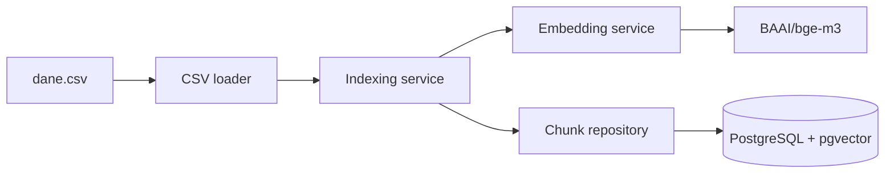

# EWC — RAG Evaluation Project

> A reproducible local environment for building and evaluating retrieval strategies over a fixed document corpus.


## Overview

EWC is a local Retrieval-Augmented Generation (RAG) project focused on retrieval experiments and evaluation. It loads a fixed corpus of prepared document chunks from CSV, generates dense embeddings with [`BAAI/bge-m3`](https://huggingface.co/BAAI/bge-m3), and stores them in PostgreSQL with pgvector.

Keeping the corpus fixed makes retrieval strategies directly comparable without introducing differences caused by chunking.

## Architecture



The environment consists of three Docker services:

- `backend` — corpus loading, indexing and persistence,
- `embedding_service` — FastAPI service generating dense embeddings,
- `postgres` — PostgreSQL 16 with pgvector.

## Current Status

Implemented:

- fixed-corpus CSV loading with stable chunk identifiers,
- batched embedding generation and database writes,
- idempotent indexing with PostgreSQL UPSERT,
- Docker Compose environment with service health checks,
- reproducible full-corpus indexing from an empty database.

Planned:

- vector retrieval,
- retrieval evaluation pipeline.

## Quick Start

### Requirements

- Docker
- Docker Compose

No local Python installation is required.

### 1. Configure the environment

Create a `.env` file in the project root:

```dotenv
EMBEDDING_MODEL=BAAI/bge-m3
```

The backend connection settings are supplied by Docker Compose.

### 2. Start the services

```bash
docker compose up -d --build
docker compose ps
```

The first build may take longer because the embedding model needs to be downloaded.

### 3. Index the corpus

```bash
docker compose exec backend uv run python scripts/index_chunks.py
```

For the included dataset, a successful run prints:

```text
Indexed 735 chunks.
```

Indexing is idempotent, so running the command again updates existing rows instead of creating duplicates.

### 4. Verify the result

```bash
docker compose exec postgres \
  psql -U ewc -d ewc \
  -c "SELECT COUNT(*) FROM chunks;"
```

The expected row count for the included dataset is `735`.

## Database Schema

| Column | Description |
| --- | --- |
| `id` | Internal database identifier |
| `chunk_id` | Stable unique chunk identifier |
| `filename` | Source document filename |
| `content` | Original chunk text |
| `embedding` | 1024-dimensional embedding generated by `BAAI/bge-m3` |

The application initializes the pgvector extension and the `chunks` table before opening the repository connection pool.

## Testing

Run the embedding service test suite inside its container:

```bash
docker compose exec embedding_service pytest
```

## Project Structure

```text
EWC/
├── backend/
│   ├── app/
│   │   ├── clients/          # external service clients
│   │   ├── core/             # application configuration
│   │   ├── db/               # database connection and schema
│   │   ├── loaders/          # corpus loading
│   │   ├── models/           # domain models
│   │   ├── repositories/     # persistence layer
│   │   └── services/         # application services
│   ├── scripts/              # executable backend scripts
│   ├── Dockerfile
│   ├── pyproject.toml
│   └── uv.lock
├── embedding_service/
│   ├── app/                  # embedding API and model service
│   ├── tests/
│   ├── Dockerfile
│   └── requirements.txt
├── docs/                     # research and evaluation notes
├── scripts/                  # data preparation utilities
├── dane.csv                  # fixed document corpus
├── docker-compose.yml
└── README.md
```

## Reproducibility

To verify the complete pipeline from a clean database, remove the containers and PostgreSQL volume before repeating the Quick Start steps:

```bash
docker compose down -v
docker compose up -d --build
docker compose exec backend uv run python scripts/index_chunks.py
```

A successful clean run should produce the same `735` indexed chunks.
